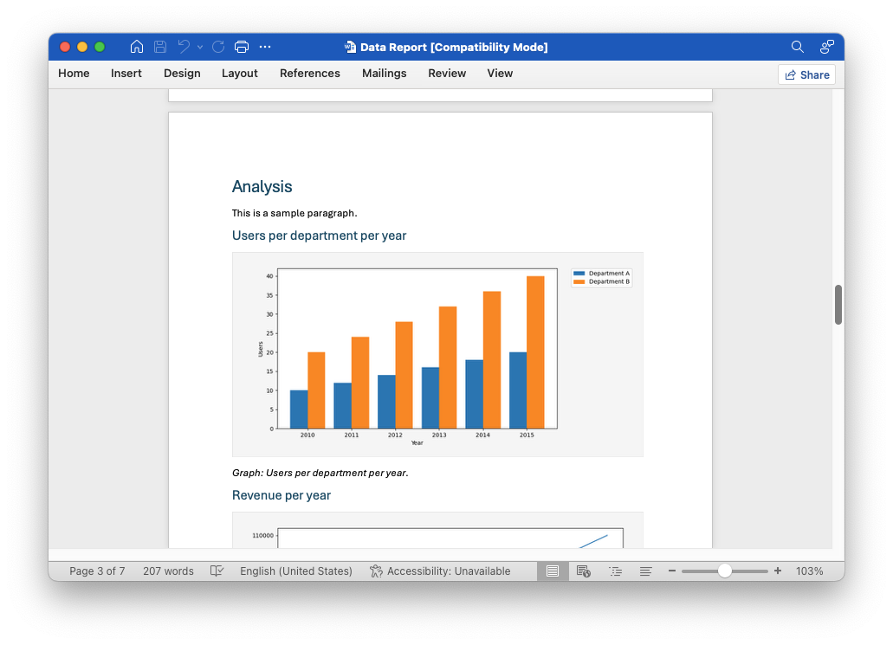

 
 

 
 
<strong>Data Reporting</strong>

 
 

Document objects and tabular data converted to beautiful reports.

 
 

__How to run__

 

1. Fill out `/input/parameters.json` with document objects
2. Execute `compile.sh` or `compile.bat` to generate output
3. OPTIONAL: Execute `publish.sh` or `publish.bat` to publish output

 
 

__Document object properties__

 

| Field      | Description                                               | Example/Values              | Required |
|:-----------|:----------------------------------------------------------|:----------------------------|:---------|
| template   | Path to DOCX template                                     | "input/template.docx"       | Yes      |
| language   | Language code                                             | "en"                        | Yes      |
| title      | Title of the document                                     | "Data Report"               | Yes      |
| author     | Author name                                               | "Thor"                      | Yes      |
| toc        | Table of contents title (if present, adds TOC)            | "Contents"                  | No       |
| split      | Field to split documents by                               | "Company"                   | No       |
| contents   | List of content blocks (headers, paragraphs, etc.)        | [ ... ]                     | Yes      |

 
 

__Content object properties__

 

| Type      | Description                    | Example Fields                         |
|:----------|:-------------------------------|:---------------------------------------|
| header1   | Top-level section header       | "header1": "Introduction"              |
| header2   | Subsection header              | "header2": "Users per department..."   |
| header3   | Subsubsection header           | "header3": "Users per department..."   |
| header4   | Subsubsubsection header        | "header4": "Users per department..."   |
| header5   | Subsubsubsubsection header     | "header5": "Users per department..."   |
| header6   | Subsubsubsubsubsection header  | "header6": "Users per department..."   |
| paragraph | Paragraph text                 | "paragraph": "This is a sample..."     |
| pagebreak | Page break                     | "pagebreak": true                      |
| graph     | Chart/graph block              | graph, description, source, x, y, ...  |
| table     | Table block                    | table, description, delimiter, ...     |

 
 